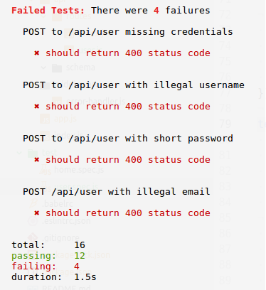

# ws-backend-validation

## These tests are failing!



All the routes are returning 200, but some of them should be returning 400.
Fix them by following the below instructions.

## Add the following validations
Make sure they are:
- [validated](https://github.com/andrewkeig/express-validation), and that the correct responses are sent if the requests fail validations
- fully tested using Supertest. Check well formed and poorly formed post bodies.

### POST /user
```
{
  username: String (only letters and numbers)
  password: String (with validation)
  email: String (valid emails allowed only)
  dob: Date (user must be over 18)
}
```

### UPDATE /user
```
{
  username: String (only letters and numbers)
  email: String (valid emails allowed only)
  dob: Date (user must be over 18)
}
```

Try some others too.
